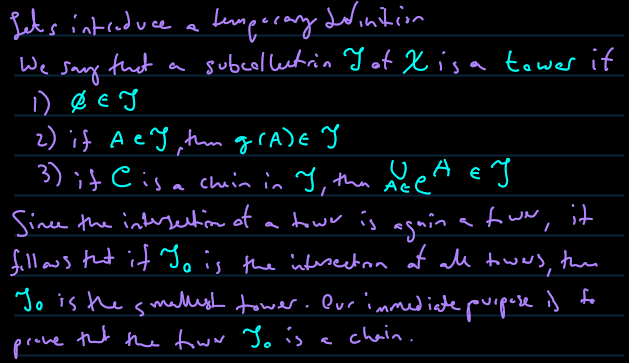
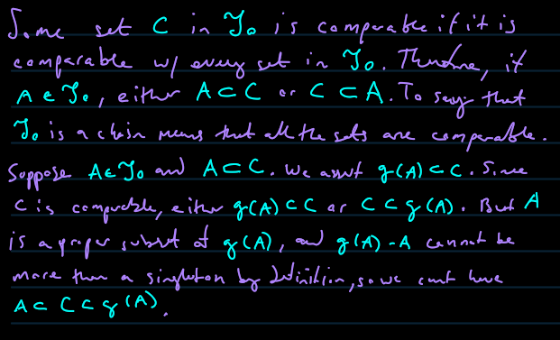

- [Zorn's Lemma](#orge8da498)
  - [Motivation](#org72a635b)
  - [**Zorn's Lemma**](#orgacde898)
  - [Basic Idea of Proof](#orgcf981a6)
  - [Proof](#org6056697)

# Zorn's Lemma

An existance theorem asserts the existence of an object belonging to a certain set and possessing certain properties. We can typically formulate an existence theorem so that it can be formulated so that the underlying set is a partially ordered set and the crucial property is maximality.

## Motivation

From Wikipedia:

Sometimes one wants to prove the existence of a mathematical object (which can be viewed as a maximal element in some poset). One could try proving the existence of such an object by assuming there is no maximal element and using transfinite induction and the assumptions of the situation to get a contradiction. Zorn's lemma tidies up the conditions a situation needs to satisfy in order for such an argument to work. Therefore Zorn's lemma enables mathematicians to not have to repeat the transfinite induction argument by hand each time, but just check the conditions of Zorn's lemma.

If you are building a mathematical object in stages and find that (i) you have not finished even after infinitely many stages, and (ii) there seems to be nothing to stop you continuing to build, then Zorn’s lemma may well be able to help you.

— William Timothy Gowers, "How to use Zorn’s lemma"

## **Zorn's Lemma**

**If X is a partially ordered set such that every chain in X has an upper bound, then X contains a maximal element.**

A chain is a totally ordered set. By a chain in X we mean a subset of X such that the subset, considered as a partially ordered set on its own right, turns out to be totally ordered.

If A is a chain in X, then Zorn's lemma guarantees the existence of an upper bound for A in X; it does not guarantee the existence of an upper bound of A in A. The conclusion of Zorn's Lemma is the existence of an element a in X with the property

## Basic Idea of Proof

Suppose that X is not empty and it has an element, x0. If x0 is maximal, stop here.

If it is not, then there exists an element x1 strictly greater than x0. If x1 is maximal, stop here.

Repeat this argument ad infinitum; ultimately it must lead to a maximal element.

This doesn't work &#x2013; what if we have an infinite sequence of non-maximal elements? Since the range of an infinite sequence is a chain in X and consequently has an upper bound, we can start the argument all over again beginning with that given bound.

## Proof

